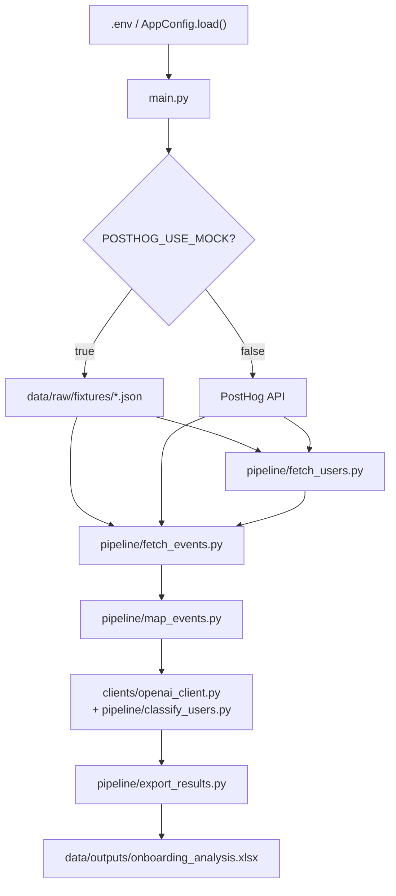
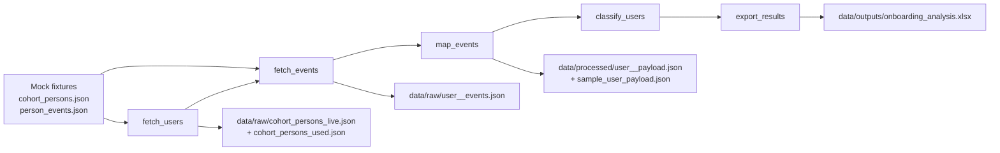

# Architecture Notes

## Overview

The project is a linear local pipeline:

1. Load and validate runtime config.
2. Fetch cohort users from PostHog or local fixtures.
3. Fetch each user’s event timeline.
4. Map events into deterministic onboarding hints.
5. Classify each journey with OpenAI.
6. Export a formatted Excel workbook.

`main.py` orchestrates the full flow and owns the runtime order.

## Diagrams

### System Flow

### Artifact Flow

## Runtime Flow

### 1. Configuration

`config.py` loads `.env`, normalizes paths, validates required variables, and creates the local data directories used by the pipeline.

Important configuration behaviors:

- `POSTHOG_USE_MOCK=true` bypasses live PostHog fetches
- `OUTPUT_XLSX_PATH` is normalized to an `.xlsx` path even if a CSV-style name is supplied
- live mode rejects `POSTHOG_API_KEY` values that look like `phc_...` ingestion keys

### 2. PostHog Access

`clients/posthog_client.py` wraps the minimal PostHog HTTP operations used by the project:

- `test_auth()` validates the Bearer key
- `fetch_cohort_persons(...)` fetches the configured cohort members
- `fetch_events(...)` fetches events for a distinct ID in a bounded time window

This module intentionally isolates PostHog endpoint details so the rest of the pipeline can stay stable if the API contract changes.

### 3. User Normalization

`pipeline/fetch_users.py` converts raw PostHog persons into `CandidateUser` records.

`CandidateUser` contains:

- `person_id`
- `distinct_id`
- `distinct_ids`
- `name`
- `email`
- `properties`
- `raw`

The module also writes:

- `data/raw/cohort_persons_live.json` in live mode
- `data/raw/cohort_persons_used.json` for the filtered user set actually analyzed

### 4. Event Timeline Loading

`pipeline/fetch_events.py` builds `UserTimeline` records from either:

- `data/raw/fixtures/person_events.json` in mock mode
- PostHog `/events/` API responses in live mode

Key behaviors:

- timelines are combined across all known `distinct_ids`
- events are deduplicated by event ID when available
- events are sorted ascending by timestamp
- each user’s final raw event timeline is written to `data/raw/user_<id>_events.json`

### 5. Deterministic Mapping

`pipeline/map_events.py` transforms each `UserTimeline` into a `MappedJourney`.

`MappedJourney` contains:

- normalized first and last timestamps
- journey duration
- stage flags
- activation detection
- `error_events`
- `permission_events`
- top event counts
- a trimmed timeline excerpt
- the final `llm_payload`

The mapper is where the non-LLM logic lives:

- wildcard stage matching via `STAGE_PATTERNS`
- activation detection via `ACTIVATION_EVENTS`
- backend tracing via `ERROR_EVENTS`
- permission signal extraction via `PERMISSION_PATTERNS`

The mapper writes model-ready payloads to `data/processed/user_<id>_payload.json` and also keeps `sample_user_payload.json` for quick inspection.

### 6. OpenAI Classification

`clients/openai_client.py` and `pipeline/classify_users.py` own the LLM step.

Prompt construction lives in `prompts.py`. The prompt requires a strict JSON response with:

- `activated`
- `category`
- `dropoff_point`
- `notes`
- all onboarding stage YES/NO fields

Classification behavior:

- first attempt uses the standard system and user prompts
- if JSON parsing fails, the client retries once with a repair prompt
- if the overall classification step still fails, `pipeline/classify_users.py` uses deterministic fallback logic

The fallback classifier promotes:

- `Misclassified / already activated` if activation was detected
- `Backend issue` if mapped `error_events` exist
- `Permission issue` if permission events exist
- `Exploration without activation` if the raw event count is high enough
- otherwise `Early drop`

### 7. Workbook Export

`pipeline/export_results.py` writes the final `ClassifiedJourney` rows to Excel.

Current workbook behavior:

- output file is `.xlsx`
- detail worksheet name is `Onboarding Analysis`
- summary worksheet name is `Summary`
- timestamps are converted to Australia/Melbourne display values at export time
- workbook includes a dedicated `Error Events` column
- dropoff points are normalized to canonical stage labels before export and summary counting
- header, striping, category colors, and YES/NO status coloring are applied

The exporter is presentation-focused. Internal timestamp storage remains ISO strings until export.

## Key Runtime Models

### `AppConfig`

Loaded in `config.py`, used by every pipeline stage for env-driven behavior and path management.

### `CandidateUser`

Normalized cohort person record produced by `pipeline/fetch_users.py`.

### `UserTimeline`

User plus ordered events, produced by `pipeline/fetch_events.py`.

### `MappedJourney`

Rule-based summary and LLM payload, produced by `pipeline/map_events.py`.

### `ClassifiedJourney`

Normalized final row used by the exporter, produced by `pipeline/classify_users.py`.

## Data And Artifact Flow

### `data/raw/`

Used for PostHog debug visibility:

- cohort payload snapshots
- per-user event timelines
- fixtures for mock mode

### `data/processed/`

Used for model inspection:

- per-user OpenAI payloads
- one sample payload for quick reading

### `data/outputs/`

Used for analyst-facing output:

- `onboarding_analysis.xlsx`

## Known Constraints

- The pipeline is sequential. There is no concurrency control or batching layer.
- The test suite is small and focused on workbook/classification behavior, not full API integration.
- Live runs depend on external PostHog and OpenAI availability.
- The repo also contains historical build notes and local credential artifacts that should not be treated as the system design source of truth.
